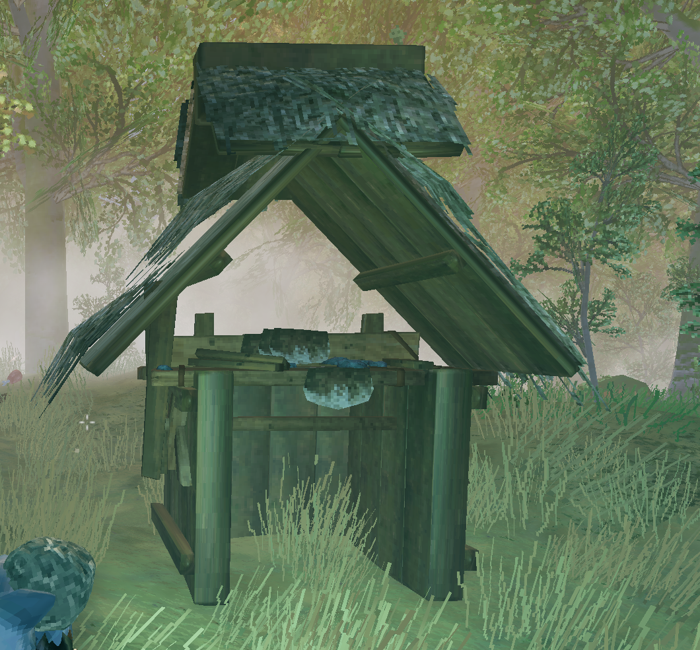

# Workbench Hut

A Valheim mod that adds a **Workbench Hut** to the hammer — a compact open-front wooden shed with a functional workbench inside, placed in one build action.

## Requirements

- [BepInEx Pack for Valheim](https://valheim.thunderstore.io/package/denikson/BepInExPack_Valheim/)
- [Jötunn](https://valheim.thunderstore.io/package/ValheimModding/Jotunn/)

## Installation

1. Install BepInEx and Jötunn if you have not already.
2. Download the latest release from [GitHub Releases](https://github.com/Darknetzz/valheim-workbench-hut/releases).
3. Extract the `WorkbenchHut` folder into your Valheim plugins directory:

   `Valheim/BepInEx/plugins/WorkbenchHut/`

   You should end up with `WorkbenchHut.dll` and a `Translations` folder inside that directory.
4. Launch the game and enter a world.

## In-game usage

1. Equip the **hammer**.
2. Open the build menu.
3. Go to the **Crafting** tab.
4. Select **Workbench Hut** (14 Wood, 1 Stone).
5. Place it — you get walls, roof, and a workbench in one structure.

Interact with the workbench to craft as usual. The hut is one structure; removing it removes the whole thing.

## Building from source

1. Install Visual Studio 2022 with the .NET desktop workload.
2. Install BepInEx into your Valheim folder.
3. Copy `Environment.props.example` to `Environment.props` and set your Valheim install path.
4. Open `WorkbenchHut.sln` and build **Release**.

After a **Release** build, the output is at:

`WorkbenchHut/bin/Release/net48/`

Copy `WorkbenchHut.dll` and the `Translations` folder into `BepInEx/plugins/WorkbenchHut/`. A post-build script can also deploy to your Valheim folder if `Environment.props` is configured.

## Multiplayer

All players need this mod installed. Server hosts should install it on the dedicated server as well.
